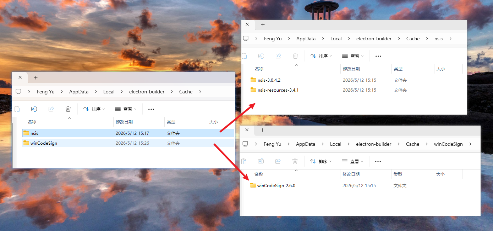

# WoAiTest

基于 Electron + React 的 API 测试工具桌面应用，提供直观的图形界面来管理项目、配置环境和执行 API 测试。

## 功能特性

### 核心功能
- ✅ **项目管理** - 扫描目录导入项目，多项目快速切换，数据自动保存
- ✅ **环境配置** - 底部栏快速切换环境，多环境变量矩阵管理
- ✅ **API 分组** - 自定义层级分组，支持拖拽移动分组和 API
- ✅ **API 编辑** - 完整的 API 配置编辑，支持 Params/Headers/Body/断言
- ✅ **URL 构建器** - 可视化片段编辑，支持环境变量注入
- ✅ **调用链** - 自动检测 `{{ref:...}}` 依赖，按顺序执行
- ✅ **JSON/XML 可视化编辑** - JSON 和 XML 均支持代码模式和 UI 树模式双编辑
- ✅ **变量引用** - 可视化选择器配置 `{{ref:apiId.fieldPath}}`
- ✅ **断言验证** - JSONPath 表达式，支持多条断言
- ✅ **Body 类型** - none / form-data / x-www-form-urlencoded / raw
- ✅ **显式保存** - 保存按钮手动保存，编辑完成后再提交，避免频繁自动触发脏标记
- ✅ **通知系统** - 按项目隔离的内存通知，支持文件位置打开等操作按钮
- ✅ **执行历史** - 保存执行记录，支持查看详情和恢复请求
- ✅ **主题切换** - 暗黑/白昼两种主题，CSS 变量驱动，欢迎页和主界面均支持切换
- ✅ **面板系统** - 三栏可调宽度布局，面板可独立显隐
- ✅ **路径搜索** - 搜索范围扩展到 API 请求路径和场景路径，全内存匹配无需 I/O
- ✅ **引用查看** - API 菜单新增「查看引用」，弹窗展示被引用的 API 和场景，可点击跳转
- ✅ **完整性检查** - 加载项目时自动校验索引 ↔ 文件一致性，孤儿文件以表格列表展示（含操作列），支持单个删除或忽略进入
- ✅ **工作空间** - 欢迎页加载整个配置目录，内部多项目全量缓存，切换零延迟
- ✅ **空间管理** - 导入空间后自动进入，空空间引导创建项目；底部栏支持新增/重命名/删除项目
- ✅ **API 文档生成** - 一键生成 Markdown 文档，支持 Electron 保存和浏览器下载
- ✅ **响应展示** - 多卡片显示调用链各环节结果，请求/响应详情查看
- ✅ **Toast 提示** - 顶部居中自动消失的通知提示（保存成功/错误等瞬时消息）

### 界面布局

```
┌──────────────────┬─────────────────────┬──────────────────┐
│  左侧面板        │  中间面板            │  右侧面板         │
│  API 分组树      │  API 编辑/执行器     │  响应面板         │
│  模糊搜索        │  Params/Headers/    │  链结果卡片       │
│  拖拽排序        │  Body/断言/历史      │  请求详情         │
│  操作菜单        │  URL 构建器          │  响应详情         │
│  宽度: 200-600px │  宽度: 最小 350px    │  宽度: 300-800px  │
├──────────────────┴─────────────────────┴──────────────────┤
│  底部栏: 项目切换 / 环境选择 / 变量查看 / 通知 / 面板切换 / 主题 / DevTools │
└───────────────────────────────────────────────────────────┘
```

## 项目结构

```
api_test_ui/
├── electron/              # Electron 主进程
│   ├── main.js           # 主进程入口，IPC 通信，HTTP 请求代理
│   └── preload.js        # 预加载脚本，暴露 API 到渲染进程
├── src/                  # React 前端
│   ├── components/       # React 组件
│   │   ├── APIMain.js / .css        # API 分组树（搜索/拖拽/操作菜单）
│   │   ├── APIDetail.js / .css      # API 编辑器 + 执行器
│   │   ├── BottomBar.js / .css      # 底部栏（项目/环境/通知/面板/主题）
│   │   ├── ResponsePanel.js / .css  # 响应展示面板
│   │   ├── MonacoView.js / .css     # Monaco 编辑器统一封装
│   │   ├── CodeEditor.js            # 代码编辑器（关联语言类型）
│   │   ├── BodyTreeEditor.js / .css # JSON/XML 可视化树编辑器
│   │   ├── KVTable.js / .css        # 键值表格（Params/Headers/Body）
│   │   ├── KVBottomPanel.js / .css  # KV 引用变量底部面板
│   │   ├── RefVariableSelector.js / .css # 变量引用可视化选择器
│   │   ├── EnvVarManager.js / .css  # 环境变量矩阵管理
│   │   ├── ExecutionHistory.js / .css # 执行历史记录列表
│   │   ├── HistoryDetailDialog.js / .css # 历史详情弹窗
│   │   ├── ChainSelector.js / .css  # 依赖链选择器
│   │   ├── InputDialog.js / .css    # 输入对话框
│   │   ├── ConfirmDialog.js / .css  # 确认对话框
│   │   ├── EmbeddedProgress.js / .css # 进度组件（进度条/问题表格/操作按钮）
│   │   ├── ProgressOverlay.js / .css # 全局进度覆盖层
│   │   ├── EmptyState.js / .css     # 空状态/欢迎页
│   │   ├── Toast.js / .css          # Toast 提示组件（顶部居中，自动消失）
│   │   └── ProjectSelector.js / .css # 项目选择器
│   ├── utils/           # 工具类（单例模式）
│   │   ├── ProjectManager.js      # 项目数据管理器
│   │   ├── APIExecutor.js         # 单 API 执行器
│   │   ├── ChainManager.js        # 依赖链执行编排
│   │   ├── NotificationManager.js # 通知管理器（按项目隔离）
│   │   ├── APIDocGenerator.js     # API 文档生成器
│   │   ├── JSONSchemaConverter.js # JSON/Schema 互转
│   │   ├── XMLSchemaConverter.js  # XML/Schema 互转（基于 fast-xml-parser）
│   │   └── HTTPValidator.js       # HTTP 头部验证工具
│   ├── App.js / .css     # 主应用组件（三栏布局 + 状态管理）
│   ├── index.js          # 入口文件
│   └── index.css         # 全局样式 + CSS 变量主题
├── data/                # 项目数据目录（运行时创建）
├── public/
│   └── index.html       # HTML 模板
├── build/               # 生产构建产物
├── design/              # 架构设计文档
├── github下载包/         # Electron 构建缓存包
├── .npmrc               # Electron 镜像配置
├── start.sh             # Bash 启动脚本
├── package.json
└── README.md
```

## 环境要求

- Node.js 16+
- npm 或 yarn

## 安装依赖

```bash
cd api_test_ui
npm install
```

## 运行方式

### 开发模式（React Dev Server + Electron）

```bash
# 开发模式（React + Electron，无热加载）
npm run dev

# 热加载模式（React + Electron 热加载，文件修改自动刷新窗口）
npm run dev:hot

# 仅 Electron 热加载（监听 electron/ 目录）
npm run dev:electron

# 全热加载模式（React + Electron 均热加载）
npm run dev:all
```

### 仅启动前端（浏览器调试）

```bash
npm run react-start
```

访问 http://localhost:3000。浏览器模式下使用模拟数据，不进行文件操作。

### 生产模式

```bash
# 构建 React 应用
npm run build

# 启动 Electron 应用（生产模式，需先构建）
npm start
```

### 构建桌面安装包

```bash
# windows打包：管理员身份进入powershell运行
npm run electron-build
```
#### 由于github某些包下载缓慢或无法下载，现提供解决办法
我先下载好了放到了项目下的[github下载包](github下载包)目录
1. [winCodeSign](github下载包/winCodeSign-2.6.0.7z) 包解压后放到`C:\Users\用户名\AppData\Local\electron-builder\Cache\winCodeSign`
2. [nsis](github下载包/nsis-3.0.4.1.7z) 包解压后放到`C:\Users\用户名\AppData\Local\electron-builder\Cache\nsis`
3. [nsis-resources](github下载包/nsis-resources-3.4.1.7z) 包解压后放到`C:\Users\用户名\AppData\Local\electron-builder\Cache\nsis`

类似于如下图，版本可能不同


支持 Windows（NSIS）、macOS（DMG）、Linux（AppImage）。

## 使用说明

### 1. 创建/导入空间

启动应用后，在欢迎页可以：
- **新增空间** - 选择目录，输入项目名称，自动创建并进入
- **导入空间** - 选择包含项目子目录的空间目录，自动扫描并进入（若空间内无项目则引导创建）

进入空间后，底部栏项目选择器支持：
- **新增项目** - 在当前空间下新建项目，自动切换到新项目（带脏检查）
- **修改项目名称** - 修改当前项目的名称
- **删除项目** - 需输入项目名称确认后方可删除，删除后自动切换到其他项目或退出空间
- **项目切换** - 点击项目名称快速切换，有未保存修改时弹窗确认

项目数据以 `{projectId}/config.json` + `{projectId}/apis/` 格式存储。

### 2. 管理环境

- **切换环境** - 底部栏点击环境名称选择
- **编辑环境** - 底部栏点击齿轮图标进入环境变量矩阵
- **环境变量** - 支持多环境独立配置，变量名在所有环境保持一致

### 3. 管理 API

- **新增 API** - 分组标题右侧 + 按钮，或操作菜单选择
- **搜索 API** - 顶部搜索框支持按名称、请求路径、场景路径、场景名、ID、组名模糊匹配（全内存）
- **分组管理** - 支持嵌套层级、拖拽重排、复制、重命名
- **API 操作** - 更多菜单支持复制、复制 ID、查看引用、删除
- **引用查看** - 查看 API 被哪些 API 引用，按引用场景分组展示，点击跳转

### 4. 编辑 API

- **保存** - 编辑完成后点击场景行中的保存按钮（💾 图标）手动提交，数据写入缓存并触发落盘
- **编辑模式** - 点击 URL 旁的编辑按钮（✏️ 图标）进入路径/方法编辑模式，完成编辑后点击 ✅ 退出（不触发保存）
- **发送自动保存** - 点击发送按钮时自动保存当前编辑内容，确保执行的是最新数据

每个 API 包含以下配置项：

| 配置项 | 说明 |
|--------|------|
| **名称** | API 标识名称 |
| **方法** | GET / POST / PUT / DELETE / PATCH / HEAD / OPTIONS |
| **URL** | 可视化片段编辑器，支持 `{变量名}` 引用环境变量 |
| **Params** | URL 查询参数（Key-Value 表格） |
| **Headers** | 请求头（Content-Type 自动管理） |
| **Body** | none / form-data / x-www-form-urlencoded / raw |
| **Raw 内容** | 支持 Text / JSON / XML / HTML，JSON 和 XML 均有代码和 UI 树双模式 |
| **断言** | JSONPath 断言表达式，支持多条 |

### 5. JSON/XML 可视化编辑器

JSON 和 XML 均支持代码模式与 UI 树模式双向编辑：

- **代码模式** - Monaco 编辑器语法高亮，实时校验
- **UI 树模式** - 树形结构展示，支持添加/删除/修改节点
- **类型切换** - JSON 支持 string/number/boolean/null/object/array
- **XML 特性** - 支持属性管理、混合内容检测（可开关）
- **格式校验** - JSON 和 XML 均实时校验，格式错误时 UI 按钮自动禁用并显示错误角标
- **数据同步** - 代码与 UI 模式之间双向同步，自动转换
- **值引用** - 单元格可使用 `{{ref:apiId.fieldPath}}` 引用其他 API 返回值

使用 `{{ref:apiId.字段路径}}` 格式引用其他 API 的响应结果：

- **Params/Headers/Body (form-data/x-www-form-urlencoded)** - 使用 `RefVariableSelector` 可视化选择器配置
- **Raw Body** - 手动输入 `{{ref:apiId.fieldPath}}` 格式
- **JSON UI 模式** - 在字符串值中可直接引用

### 6. 发送请求

点击"发送"按钮执行 API（自动执行依赖链中的前置 API）。

### 7. 生成文档

点击"生成文档"按钮生成 Markdown 格式的 API 文档：
- **Electron 环境** - 弹出文件保存对话框，保存至本地文件
- **浏览器环境** - 直接下载

## 动态标记

| 标记格式 | 说明 | 示例 |
|----------|------|------|
| `{{ref:API_ID.字段路径}}` | 引用其他 API 返回值 | `{{ref:api_token_001.data.token}}` |
| `{{readFile:文件名}}` | 读取文件内容为字符串 | `{{readFile:NC2Lims.xml}}` |
| `{{file:文件名}}` | 文件上传 | `{{file:upload.txt}}` |
| `{变量名}` | 引用环境配置变量 | `{domain}{api-prj}/openapi/...` |

## 断言表达式

使用 JSONPath 表达式验证响应结果，支持操作符：`==`、`!=`、`>`、`<`、`>=`、`<=`

```
$.code == 200
$.data.list.length > 0
$.success == true
```

## 项目配置格式

数据分为两层：

**项目级 `config.json`** — 项目信息、环境配置、分组树、API 索引：

```json
{
  "version": 3,
  "projectName": "项目名称",
  "profile": [
    { "activate": true, "name": "dev", "domain": "192.168.1.1", "api-prj": ":8080/api" }
  ],
  "groups": [
    { "id": "grp_001", "name": "认证模块", "parentId": null }
  ],
  "apis": [
    {
      "id": "api_001",
      "name": "获取 token",
      "group": "grp_001",
      "api_path": "{domain}{api-prj}/token",
      "method": "POST"
    }
  ]
}
```

**每 API 文件 `apis/{apiId}_config.json`** — 场景数据（header/param/body/assertions）：

```json
{
  "id": "api_001",
  "name": "获取 token",
  "method": "POST",
  "api_path": "{domain}{api-prj}/token",
  "group": "grp_001",
  "scenarios": {
    "scn_001": {
      "id": "scn_001",
      "name": "默认场景",
      "header": { "Content-Type": "application/json" },
      "param": {},
      "body": { "type": "json", "content": "{}" },
      "assertions": [
        { "expression": "$.code == 200", "enabled": true }
      ]
    }
  }
}
```

> API 索引中的 `method` / `api_path` 为速查字段，完整定义以 API 配置文件为准。

### Body 类型

| 类型 | 说明 | 支持文件上传 |
|------|------|------------|
| none | 无请求体 | - |
| form-data | 表单数据 | ✅ |
| x-www-form-urlencoded | URL 编码表单 | ❌ |
| raw | 原始内容（text/json/xml/html） | ❌ |

### 参数类型

`string`、`number`、`boolean`、`file`（仅 form-data）

## 技术栈

- **Electron 28** - 桌面应用框架
- **React 18** - UI 框架
- **Monaco Editor** - 代码编辑器（@monaco-editor/react）
- **Axios** - HTTP 请求库（Electron 主进程执行）
- **Lucide React** - 图标库
- **fast-xml-parser** - XML 解析与校验
- **react-syntax-highlighter** - 代码高亮
- **CSS Custom Properties** - 主题变量驱动样式

## 开发规范

- **UTF-8 编码**，中文界面和注释
- **组件名**: 大驼峰命名（PascalCase）
- **函数名**: 小写下划线（snake_case）
- **常量名**: 大写下划线（UPPER_CASE）
- 组件化设计，职责单一

## 重要注意事项

1. **API ID 是唯一标识** - 用于调用链引用和动态参数引用（非 API 名称）
2. **环境检测** - 通过 `window.electron` 检测 Electron 环境
3. **数据存储** - 每项目 `config.json`（元数据 + API 索引）+ `apis/{apiId}_config.json`（场景数据）+ `apis/{apiId}_history.json`（执行历史）
4. **保存策略** - 编辑内容通过保存按钮或发送按钮手动提交到缓存；项目级脏数据 5 秒自动落盘
5. **通知** - 按项目隔离存储在内存中，切换项目不删除缓存
6. **Content-Type** - 由 Body 类型自动管理，不可手动修改
7. **SSL** - Electron 全局忽略自签名证书错误（`rejectUnauthorized: false`）
8. **CORS** - HTTP 请求通过 Electron 主进程发出，不受浏览器 CORS 限制
9. **面板** - 至少保持一栏可见，宽度可拖拽调整（左 200-600px，右 300-800px）

## 默认分组

"默认"分组是一个**纯逻辑分组**，不在 `config.groups` 中持久化：

- **不在数据中** — `config.json` 的 `groups` 数组里没有 `{ id: "default", ... }` 记录
- **UI 注入** — `getGroupTree()`（APIMain.js）和 `getFlatGroupsWithLevel()`（ProjectManager.js）在构建树时**内存中注入** `{ id: 'default', name: '默认', parentId: null }`
- **保护规则** — `deleteGroup` 跳过 `id === 'default'` 的分组；不支持拖拽、重命名、删除；新建分组禁止命名为"默认"

## 变更记录

### 2026-05-29（回收站移除 + 孤儿文件管理）
- **回收站功能移除** — 注释掉所有回收站入口、trash 数据写入逻辑及 IPC 处理，保存时清理 config.json 中的 `trash` 属性
  > ⚠️ `preload.js` 中仍暴露 `moveAPIFileToTrashed`、`moveAPIToTrash`、`restoreAPIFromTrash`、`permanentDeleteTrashAPI` 桥接（待清理）
- **物理删除** — 删除 API/分组改为直接物理删除文件（`deleteAPIFile`），不再软删除到回收站
- **孤儿文件表格** — 问题页孤儿文件改为表格展示（API名称 / 文件地址 / 描述 / 操作），表头固定，支持逐条删除
- **取消按钮** — 问题页新增「取消」按钮（警告色），点击回退到欢迎页
- **rename** — `softDeleteAPI` → `deleteAPI`，`softDeleteGroup` → `deleteGroupWithChildren`
- **README 同步** — 修正项目结构（移除不存在的 `demo/`、`AGENTS.md`，补充 20+ 缺失文件）；重写配置格式说明（双层结构 + scenarios 模型）；更正数据存储格式描述

### 2026-05-15（第四阶段 — 保存流程优化）

#### 显式保存替代自动保存
- **移除自动保存** — 删除 APIDetail 中的自动保存 useEffect（表单变化触发缓存写），改用保存按钮手动控制
- **保存按钮可见** — 场景行中的保存按钮（💾）不再隐藏，编辑完成后点击触发完整保存流程
- **确认编辑不触发保存** — ✅ 按钮仅退出路径/方法编辑模式，不再写入缓存或标记脏
- **发送前自动保存** — 发送按钮仍自动执行预保存，确保执行时数据为最新

#### 技术变更
- 移除 `autoSaveTimerRef` 和 `isFirstAutoSave` ref 及其所有引用
- 删除自动保存 useEffect（依赖 `formData`/`scenarioList`/`apiEditMode`）
- 保存按钮 `display:none` 移除，恢复可见

### 2026-05-14（第三阶段 — 场景/API 数据模型重构 + 界面密度优化）

#### API 数据模型重构
- **API 级别承载 method/api_path** — 从场景剥离，所有场景共享同一 method 和路径
- **场景仅包含 header/param/body/assertions** — 不再携带 method/api_path，数据模型清晰
- **索引条目增强** — `addAPI`/`updateAPI` 在索引中保存 `api_path`，搜索无需加载 per-API 缓存
- **V2 迁移** — `_migrateToV2` 在索引清理中保留 `api_path`
- **prepareForExecute** — 运行时合并 API 级别 method/path + 当前场景数据，向下兼容 APIExecutor

#### 场景管理 UI
- **展开式场景子列表** — 场景嵌入 API 树，可展开/折叠，显示场景名 + 删除按钮
- **场景标记点** — 场景前加圆点（scenario-dot）以区分 API 项
- **展开箭头空间保留** — 单场景 API 也保留 12px 展开箭头位，保持对齐统一
- **场景计数徽标** — 浮动半透明徽标，始终显示场景数量
- **API 操作菜单添加场景** — 支持从树中直接添加/删除场景

#### 专注模式
- **底部栏专注模式按钮** — 点击后左侧面板仅显示当前 API 的场景扁平列表
- **App.js 状态管理** — 添加 `zenMode` 状态及 `handleToggleZenMode` 处理函数

#### 描述区域取代场景栏
- **场景描述区域** — 名称输入 + 描述文本域 + 添加/删除按钮
- **移除旧的 scenario-bar 选项卡** — APIDetail.js 中删除

#### 视觉密度大幅优化
- **缩进** — 从 16px/级降为 4px/级（后根据反馈加倍至 8px/级）
- **字号** — group-name 12→13px, api-name 11→12px, scenario-item-name 10→11px, group-count 10→11px
- **图标** — 分组展开/折叠/文件夹缩小至 12px（文件夹后增至 14px）
- **分组头部** — padding 4px→2px 降低高度
- **方法色条** — 去掉 api-item 左边框，改用独立 `api-method-bar` 元素（置于展开箭头之后）
- **层级引导线** — 改用 `::before` 伪元素，经 `--guide-x` CSS 变量定位至箭头中心垂直位置，hover 显示；线仅从 content/children 顶部延伸（不穿过分组头）
- **分组名编辑** — input 与 span 严格 20px 等高，防止切换时布局跳动
- **操作按钮常驻 DOM** — 编辑模式下用 `visibility:hidden` 而非移除 DOM，保持 flex 布局不变

#### 分组管理改进
- **直接添加+内联编辑** — 去掉弹窗，一键创建"新分组"并立即进入改名模式
- **允许重复分组名** — 移除 `addGroup` 的 exists 校验
- **重命名去重校验移除** — App.js handleRenameGroup 中去掉同名检测
- **6级分组限制** — `getGroupDepth()` 检查，≥6 级隐藏"添加子分组"菜单

#### Bug 修复
- **handleAPISelect 全量加载** — 始终从缓存加载完整 per-API 配置
- **引用路径解析** — `extractRefApis`/`findRefParamsForApi` 按 `@` 分割提取 API ID
- **requestedScenarioId 泄漏** — 添加 `onRequestedScenarioHandled` 回调，`initializeFromApi` 消费后清除
- **requestedScenarioAction 竞态** — 使用 `pendingActionRef` 防止 add 在加载前丢失
- **场景切换守卫** — `useEffect([requestedScenarioId])` 增加 `scenarioList.length > 0` 检查
- **编辑模式聚焦不滚动** — `focus({ preventScroll: true })` 防止浏览器自动滚动树容器
- **计数器徽标重叠** — `right: 28px` 为操作按钮留空间

### 2026-05-14

#### 空间管理重构
- **欢迎页简化** - 移除项目列表选择 UI，导入空间后自动加载并进入第一个项目
- **文案更新** - "新建项目" → "新增空间"，"导入工作空间" → "导入空间"
- **空空间引导** - 导入无项目的空间时，自动弹出输入框引导创建项目并进入

#### 底部栏项目管理
- **新增项目** - 项目下拉菜单新增「新增项目」按钮，在当前空间下增量创建项目
- **修改项目名称** - 新增「修改项目名称」按钮，更新 config.json 并刷新项目列表
- **删除项目** - 新增「删除项目」按钮，须输入项目名称确认后方可删除；支持自动切换到其他项目或退出空间
- **路径修复** - 项目地址改为显示真实项目目录 `<workspace>/<projectId>` 而非工作空间根目录

#### 新增/修改
- `InputDialog` 新增 `onValueChange` / `confirmDisabled` / `confirmLabel` 属性
- `ProjectManager.addProjectToWorkspace()` — 增量添加项目到工作空间缓存
- `electron/main.js` 新增 `delete-project` IPC 处理器（递归删除项目目录 + 更新 project.json）
- 修改/删除操作落盘后主动调用 `scanDirectory` 刷新 `dirProjects` 确保列表实时更新

### 2026-05-13（第二阶段重构）

#### 工作空间架构 + 全量预加载
- ProjectManager 重构为多项目工作空间管理器，`projects: Map<id, ProjectData>` 
- 新增 `loadWorkspace(dirPath, onProgress)`：一次性加载目录下所有项目及其全部 API 配置到内存
- 新增 `switchProject(projectId)`：纯内存切换项目，无 I/O 开销
- 切项目时若有未保存更改，弹窗确认「保存并切换 / 放弃并切换 / 取消」
- 所有项目数据按目录缓存，底部栏切项目零延迟

#### 缓存优先写策略（脏标记 + 自动落盘）
- 所有写方法（`saveAPIConfig` / `addAPI` / `updateAPI` 等）改为只操作缓存 + 标记脏
- `saveProject()` 扩展为一次性写入：所有脏 API 文件 + config.json
- 自动保存（5s 间隔）统一调度落盘

#### 完整性检查
- 加载时自动检查：索引↔文件存在性、文件内 id 一致性、孤儿文件
- 自动修复：从索引移除缺失条目（不删文件）
- 孤儿文件以表格展示（API名称 / 文件地址 / 描述 / 操作），支持逐条删除物理文件或忽略进入
- 提供「取消」按钮回退到欢迎页

#### EmbeddedProgress 可复用组件
- 内嵌式进度组件（非 Portal 遮罩），支持进度条 / 问题列表 / 操作按钮
- 欢迎页加载时展示，配置参数可复用

#### 全内存搜索增强
- 搜索范围扩展：API 顶层 `api_path` + 各场景 `apiPath` + 场景名
- 所有搜索数据来自预加载缓存，零 I/O，无需防抖
- 移除旧版异步按需加载逻辑

#### 引用查找
- API 更多菜单新增「查看引用」入口
- 基于全量缓存正则匹配 `{{ref:targetApiId...}}`，按引用 API × 场景分组展示
- 点击引用条目直接跳转到目标 API

#### IPC 新增
- `listAPIFiles` — 列出项目 `apis/` 目录下所有 `*_config.json`，用于孤儿文件检测

### 2026-05-13（第一阶段）

#### XML 解析引擎替换
- 用 `fast-xml-parser` 替换 `DOMParser`，不再依赖浏览器原生 DOM API
- 新增 `validateXml()` 基于 `XMLValidator.validate()` 做 well-formedness 校验
- 新增 `hasMixedContent()` 基于 `preserveOrder` 模式检测混合内容（文本与标签混写）

#### XML 编辑器流程对齐 JSON
- 新增 `xmlParseError` 状态，代码模式实时校验 XML 格式
- 格式错误时 UI 按钮自动禁用 + 红色 `!` 角标
- 保存时校验 XML 格式，不合法弹 Toast 阻止保存

#### 混合内容开关
- 模式切换栏新增 `FileText` 图标按钮，控制混合内容是否允许
- 默认关闭：检测到混合内容 → UI 按钮禁用 + 保存拦截
- 开启后：混合内容不报错，数据直接透传

#### 树编辑器重命名 + 增强
- `JSONTreeEditor` → `BodyTreeEditor`，同时处理 JSON 和 XML
- XML 新建子元素自动附带 `#text` 节点，UI↔Code 切换数据不丢失
- 新增 `data-node-id` + `scrollToId`，添加子元素后自动滚动到新节点
- 模式切换遮罩：UI→Code 切换时显示进度蒙层，防止待处理变更未同步

#### 新建 API 草稿丢弃确认
- 新建 API 时，在 `initializeFromApi` 中捕获初始状态的 JSON 快照
- 每次 `formData` 变化时，通过 `JSON.stringify` 与快照比对，设置 `draftDirty` 状态
- 通过 `onDraftChange` 回调通知父组件 `App.js`，触发草稿确认逻辑
- 切换 API、编辑其他 API、关闭项目时，若有未保存草稿则弹出 `window.confirm` 确认

#### 全局进度覆盖层（ProgressOverlay）
- 新建 `ProgressProvider` + `useProgress` hook，通过 Context 全局管理进度状态
- 使用 `ReactDOM.createPortal` 渲染到 `document.body`，覆盖所有面板和弹窗
- **延迟展示**：`showProgress()` 后等待 100ms 再显示 overlay，100ms 内完成的操作不出现闪烁
- **最短展示时间**：一旦展示，至少持续 300ms 才消失，避免一闪而过
- **重入安全**：连续调用 `showProgress`/`hideProgress` 正确取消待执行定时器

## 许可证

MIT
